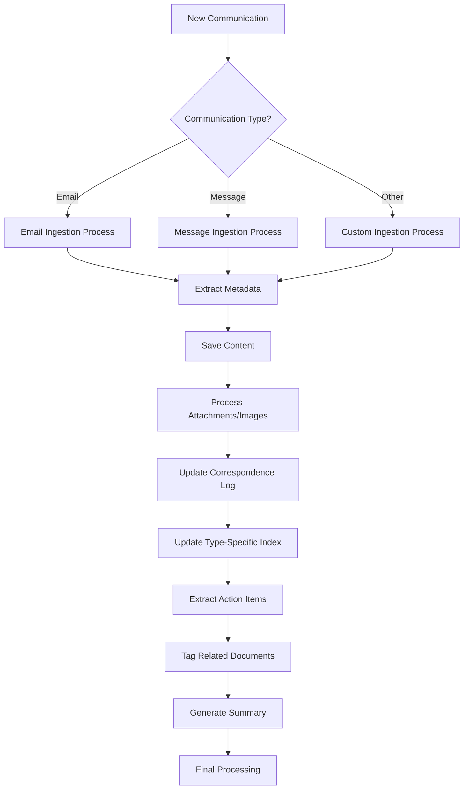

# Communication Ingestion Process

## Workflow Overview

This document outlines the standard process for ingesting and organizing all communications in the project. It provides a consistent approach for handling emails, messages, and other forms of communication.



## Universal Processing Steps

### 1. Communication Classification
- Determine communication type (email, message, call notes, etc.)
- Route to appropriate specialized ingestion prompt
- Identify communication priority and urgency

### 2. Universal Metadata Extraction
- Date received
- Sender information
- Topic/Subject
- Priority level
- Project relevance

### 3. Universal Content Processing
- Create standardized file with consistent naming convention
- Tag and categorize communication appropriately
- Ensure all formatting is properly preserved

### 4. Attachment and Resource Management
- Extract all images, files, and attachments
- Save to appropriate locations with consistent naming
- Create reference links in the communication document
- Update relevant index files

### 5. Correspondence Log Integration
- Add standardized entry to the master correspondence log
- Ensure consistent formatting across all communication types
- Include relevant links and references

### 6. Action Item Extraction
- Identify all tasks, deadlines, and commitments
- Format consistently for project tracking
- Consider integration with project task management

### 7. Relationship Mapping
- Link communication to related project features or tasks
- Connect to previous communications on the same topic
- Identify dependencies or blockers mentioned

### 8. Summary Generation
- Create standardized summary for quick reference
- Ensure key information is highlighted
- Use consistent format across all communication types

## Directory Structure

```
communications/      # Project Root Level
├── assets/          # Store all images/files here, subfoldered by YYYY-MM-DD
│   └── YYYY-MM-DD/
│       └── [original_filename_or_hash].[ext]
├── index/           # Central indexes
│   ├── master-log.md        # Chronological log of all comms
│   ├── email.index.md       # Index linking to processed emails
│   ├── message.index.md     # Index linking to processed messages
│   ├── asset.index.md       # Index linking to assets
│   └── action-item.index.md # Consolidated action items
├── processed/       # Where structured comms live
│   ├── emails/
│   │   └── YYYY-MM-DD/      # Daily folder
│   │       ├── 01-[subject-slug].md
│   │       └── 02-[subject-slug]-OUTGOING.md
│   └── messages/
│       └── YYYY-MM-DD/      # Daily folder
│           ├── 01-[topic-slug].md
│           └── ...
└── knowledge-base/  # Store extracted, structured knowledge
    └── [topic].md   # Topic-specific knowledge
```

## Maintenance

When new communication types need to be added to the system:

1. Create a specialized ingestion prompt for the new type
2. Update the ingestion workflow to include routing for the new type
3. Ensure consistent metadata extraction and processing
4. Test with sample communications before full implementation 